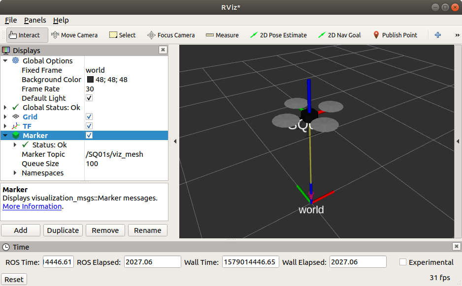
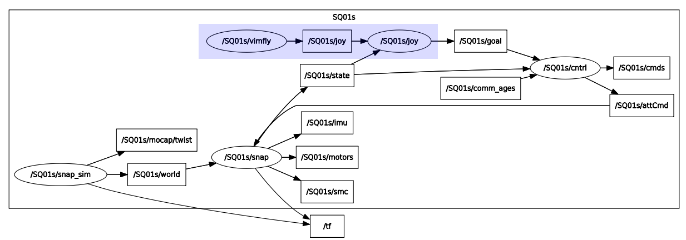

Snap Simulator
==============

This packages contains code necessary for running a software-in-the-loop (SIL) simulation of the snap stack. SIL is desirable as it uses the same architecture as the hardware use case. For example, if your high-level algorithm requires a signal that the snap autopilot provides, you can test this functionality using the very same topic in simulation. This also aides in rapid development of autopilot features.

## Getting Started

### Initializing your Catkin workspace

If you do not have a workspace, you will need to [initialize one](https://catkin-tools.readthedocs.io/en/latest/verbs/catkin_init.html). Use [`catkin-tools`](https://catkin-tools.readthedocs.io/en/latest/installing.html) (install via `pip`) for this:

```bash
mkdir -p simulation_ws/src
cd simulation_ws
catkin config --init --extend /opt/ros/melodic   # (or whatever ros distro you have)
```

### Dependencies

Standard [`snap-stack`](https://gitlab.com/mit-acl/fsw/snap-stack) are required. Your catkin_ws should have at least the following

```bash
simulation_ws
└── src
    ├── outer_loop
    ├── snap
    ├── snap_sim
    └── snapstack_msgs
```

Make sure to install the dependencies' dependencies as well!

### Building

Build with `catkin build`. Source your workspace with `source devel/setup.bash`.

### Running

To get a single vehicle running, use

```bash
roslaunch snap_sim sim.launch
```

**Note**: Check launch file for how to specify the vehicle number / starting position

## Visualization

To see the simulated vehicle, run `rviz`. Make sure to add the `TF` visualization widget and change the **Fixed Frame** global option to `world`.

To visualize a mesh (a quadrotor mesh is included by default), add a `Marker` widget (hint: try adding **By Topic**). If you would like a different mesh, you can supply the URI via launch file.

<div align="center"></div>

## Controlling

To control the simulation you will need to use a high-level trajectory generator! This is what you create when you want to test some fancy algorithm in simulation.

Alternatively, you can use the [`acl_joy`](https://gitlab.com/mit-acl/fsw/demos/acl_joy) demo to manually fly the vehicle. Note that `acl_joy` supports using a USB joystick or your keyboard. After adding `acl_joy` to your workspace and building, you can run
```bash
roslaunch acl_joy joy.launch num:=01s   # (or key.launch to use keyboard)
```

In this `rqt_graph`, the `acl_joy` package was used to manually fly the vehicle (shown in blue). This is where your high-level algorithm would connect to the [`outer_loop`](https://gitlab.com/mit-acl/fsw/snap-stack/outer_loop) via the `goal` topic.

<div align="center"></div>

## Wind simulation

The wind simulation assumes a Dryden wind turbulence model. The code used can be found here: https://github.com/goromal/wind-dynamics

## FAQ

1. In hardware the snap stack requires running the esc window to arm. How is arming / disarming taken care of in simulation?
    - Arming in `snap` is achieved using ROS service calls. The `snap_sim` node attempts to arm during initialization until it is successful.

2. Why does the simulation take time to initialize?
    - The snap stack uses the first 1000 IMU samples for calibrating the IMU. Until the IMU is calibrated, arming is not possible.

3. How does the SIL work?
    - The snap stack interfaces with two hardware components: ESCs and IMU. In order to make the SIL work, these two devices need to be simulated. This is accomplished using shared library magic. On the snapdragon, the snap stack expects the [`esc_interface`](https://gitlab.com/mit-acl/fsw/snap-stack/esc_interface) shared library to be available. Likewise, the snap stack expects the `sensor-imu` (Qualcomm proprietary) to be available. When running the snap stack on a desktop, we spoof these shared libraries with a simulation shim---an implementation amenable to simulation. The `snap_sim` node then talks to these shared libraries (which are linked to `snap`) via shared memory.

4. What exactly is being simulated?
    - `snap_sim` simulates the dynamics of a multirotor rigid body given motor commands. Additionally, `snap_sim` generates the same topics that running the [`mocap`](https://gitlab.com/mit-acl/fsw/mocap) node would in hardware. In this way, *all* the hardware components are being simulated.

5. Where are the physics coming from?
    - This dynamic simulator is using standard 6 DOF rigid body physics implemented at ACL and integrated with rk4.

6. What physical parameters are being used?
    - Parameters are pulled from `cfg`. By default, `SQ.yaml` is used (small quad) and is likely sufficient.

7. Can I change the multirotor geometry?
    - Yes, this is done in the corresponding vehicle param file.

8. What's with the `s` appended to my vehicle's name?
    - The `s` is for *simulated*. This way there is no chance of cross-talk with hardware so that all signalling remains simulated. To make other things talk to the simulated version of your vehicle simply add an `s` to the end of the vehicle number, e.g., `num:=01s`.

9. I changed the environment variable SFPRO to `true` because I want to simulate the Snapdragon Flight Pro, but the vehicle goes crazy. Why?
    - The Snapdragon Flight Pro uses a different axes convention for the imu messages, which the `snap_sim` does not consider. Since this convention is internal to the `snap` package, you can change the environment variable to `false` and your simulations should be valid even for the Snapdragon Flight Pro.
